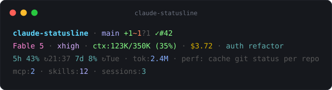
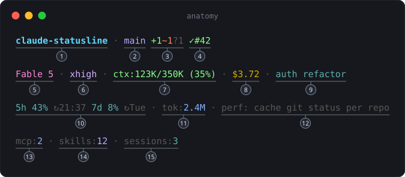

# claude-statusline

[](https://github.com/JairoTorregrosa/claude-statusline/actions/workflows/ci.yml)

A fast statusline for [Claude Code](https://code.claude.com). Written in Rust.



## Anatomy

Each segment helps you make one decision about the current session. The
numbers below match the image.



| # | Segment | Purpose |
|---|---|---|
| 1 | Repo name | Shows the repository of this session. Click the name to open the repository. |
| 2 | Branch | Shows the current branch. Shows `[wt]` when the session runs in a linked worktree. |
| 3 | Git counts | Shows `+staged ~modified ?untracked` and `↑ahead ↓behind`. |
| 4 | PR state | Shows `✓` approved, `✗` changes requested, `○` pending, `◌` draft. Click the number to open the pull request. |
| 5 | Model | Shows the model of this session. |
| 6 | Effort | Shows the reasoning effort. Effort changes cost and quality. The `⚡fast` and `¬think` badges appear when these modes differ from the default. |
| 7 | Context | Shows the tokens in the context window and the auto-compact window. Shows `⚠compact` when compaction is near. |
| 8 | Cost | Shows the session cost in USD. |
| 9 | Session name | Identifies this session when many sessions run in parallel. A name longer than 36 characters truncates. |
| 10 | Rate limits | Shows the 5-hour and the 7-day windows. The percentage shows the usage. The `↻` time shows when the window opens again. |
| 11 | Tokens | Shows the total tokens of this session: fresh input, cache writes, cache reads, and output. |
| 12 | Last commit | Shows the subject of `HEAD`. |
| 13 | MCP count | Shows the number of MCP servers loaded in this session. Each connected server adds tool definitions to the context on each turn. |
| 14 | Skill count | Shows the number of skills loaded in this session. Each skill description also uses context. |
| 15 | Sessions | Shows the number of active Claude Code sessions on this machine. A session is active when its transcript received data in the last 60 seconds. |

Line 4 shows deviations only. The counts come from the transcript of this
session, so they show the servers and the skills that the session loaded.
A zero value does not render. The full line does not render when the counts
are zero and one session is active.

## Design

The statusline renders from the JSON payload that Claude Code writes to
stdin. The hot path starts no processes and makes no network calls.

Git is the one external source. The statusline runs one
`git status --porcelain=v2 --branch` call, at most one time each 4 seconds
for each repository. Each repository has its own cache entry, so concurrent
sessions do not contaminate each other.

The pull-request state, the repository identity, and the worktree name come
from the payload. The statusline does not call `gh`.

When `~/.claude/settings.json` is not valid JSON, the context segment
measures against the model ceiling and shows a red `cfg!` marker. The
statusline does not invent a default value.

The transcript scan is incremental. The statusline stores a byte offset for
each session and reads only the new lines. One pass reads at most 4 MB, so a
large backlog does not block a render. The scan catches up across renders.
The same scan counts the loaded MCP servers and skills and sums the API
usage records into the session token total. The token total renders once
the scan has read the whole transcript — a partial sum never renders as a
total. The session count is a directory walk with no process spawns.

[DESIGN.md](DESIGN.md) lists the full design rules. [ROADMAP.md](ROADMAP.md)
lists the known limits and the planned work.

## Configuration

Configuration is optional. The file is
`~/.config/claude-statusline/config.json`. Only the ambient segments have
switches. The core lines render for everyone.

```json
{
  "inventory": true,
  "sessions": true
}
```

`inventory` controls the transcript segments: the MCP count, the skill
count, and the token total. `sessions` controls the session count. A
missing file selects the defaults (all on). An invalid file selects the
defaults and writes a warning to stderr.

## Performance

Measured on an M-series MacBook (macOS, warm filesystem cache), release
build:

| Path | Time |
|---|---|
| Warm (cache hit) | ~10 ms |
| Cold (git refresh) | ~33 ms |

Claude Code debounces statusline renders at 300 ms. Both paths are much
faster than that interval.

## Install

Requirements: `git` on `PATH`. A build from source requires Rust 1.88 or
later.

### From a release

1. Download the archive for your platform from the
   [releases page](https://github.com/JairoTorregrosa/claude-statusline/releases).
2. Extract the binary to `~/.local/bin`.
3. Set `statusLine` in `~/.claude/settings.json`:

```json
{
  "statusLine": {
    "type": "command",
    "command": "/absolute/path/to/.local/bin/claude-statusline"
  }
}
```

### From source

```sh
git clone https://github.com/JairoTorregrosa/claude-statusline
cd claude-statusline
./install.sh
```

The script builds the binary and installs it to `~/.local/bin`. The script
writes a backup of `~/.claude/settings.json` and points `statusLine` at the
binary. The script prints the previous value so you can roll back.

### With an agent

Give a coding agent this prompt:

> Clone https://github.com/JairoTorregrosa/claude-statusline and read AGENTS.md.
> Follow the install task in that file: verify the preconditions, run the steps, check the postconditions, and report the rollback value.

[AGENTS.md](AGENTS.md) gives the agent preconditions to verify, idempotent
steps, postconditions to check, and rollback rules.

## Development

```sh
cargo test          # parser, worktree and submodule resolution,
                    # payload nullability, render output
cargo clippy --all-targets -- -D warnings
```

To capture the payload that your Claude Code version sends, add one line to
any statusline script:

```sh
tee -a /tmp/statusline-payload.jsonl > /dev/null
```

A captured example lives in
[docs/sample-payload.json](docs/sample-payload.json).

## Governance

Contributions — human or agent-mediated — carry an evidence package
proportional to the risk of the files they touch. [GOVERNANCE.md](GOVERNANCE.md)
explains the zones, the evidence, and the gates; [agm.json](agm.json) is
the machine-readable form that agents read. A documentation fix carries
no burden; a change to the installer or the release pipeline must prove
itself.

## Releases

A push of a tag that matches `v*` builds the binaries for macOS and Linux,
computes checksums, and publishes a GitHub release.

## License

MIT or Apache-2.0, at your option.
